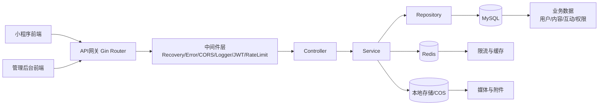

# miniprogram

基于 **Gin + GORM + MySQL + Redis** 的小程序后端服务，包含用户端接口、管理端接口、内容管理能力以及配套 API/UI 自动化测试体系。

## 功能概览

- 认证与鉴权：微信登录、管理员登录、JWT 刷新
- 内容模块：模块、文章、课程、课时、附件
- 互动能力：点赞、收藏、评论、关注、通知
- 学习记录：课程学习进度记录与查询
- 管理能力：用户、角色权限、系统配置、审计日志
- 上传能力：本地/COS 两种上传与下载地址生成

## 技术栈

- Go 1.25
- Gin
- GORM + MySQL
- Redis
- Viper
- Logrus
- k6（API 测试）
- Playwright（UI 测试）

## 业务架构图



## API 文档

- OpenAPI(Swagger) 源文件：[`api/docs/swagger.yaml`](./api/docs/swagger.yaml)
- API 前缀：`/v1`
- 健康检查：`GET /health`

> 建议将 `api/docs/swagger.yaml` 导入 Apifox / Swagger Editor / Postman 进行调试与联调。

## 快速开始

### 1) 准备环境

- Go 1.25+
- MySQL 8
- Redis 7
- （可选）Docker / Docker Compose

### 2) 配置

可通过两种方式配置：

1. 配置文件（参考 `configs/config.yaml.sample`）
2. `APP_*` 环境变量覆盖

程序会读取环境变量 `CONFIG_PATH` 作为配置文件路径；若为空则仅使用环境变量与默认值。

### 3) 启动（Docker Compose）

```bash
docker compose up -d
```

默认暴露端口：

- API: `http://localhost:8080`
- MySQL: `localhost:3306`
- Redis: `localhost:6379`

### 4) 启动（本地 Go）

```bash
go run ./cmd/server
```

或先构建再运行：

```bash
go build -o bin/server ./cmd/server
./bin/server
```

## 常用开发命令

仓库内置 `Taskfile.yml`：

```bash
task build
task test
task test-unit
task lint
task ui-test
task ui-test-down
```

等价常用命令：

```bash
go test -short ./...
go test ./...
go build -o /tmp/miniprogram-server ./cmd/server
```

## 测试说明

### Go 测试

- 快速回归：`go test -short ./...`
- 全量测试：`go test ./...`

### API 自动化（k6）

```bash
docker compose -f docker-compose.api-test.yml up \
  --exit-code-from k6 --abort-on-container-exit
```

### UI 自动化（Playwright）

```bash
docker compose -f docker-compose.ui-test.yml up \
  --exit-code-from playwright --abort-on-container-exit
```

## 目录结构

```text
cmd/server/main.go
internal/
  app/
  controller/
  service/
  repository/
  model/{entity,dto}
  middleware/
  pkg/
api/docs/swagger.yaml
migrations/
tests/{api,ui}
docs/agent-instruction.md
```

## 配置与安全建议

- 生产环境务必关闭 `debug.enable_test_token`
- 务必替换 `APP_JWT_SECRET` 与数据库默认口令
- 如使用 COS，请通过环境变量注入密钥，不要提交到仓库
- 发布前建议执行最少校验：
  - `go test -short ./...`
  - `go build -o /tmp/miniprogram-server ./cmd/server`

## CI 概览

GitHub Actions 工作流（`.github/workflows/ci.yml`）包含：

1. Unit Tests（含覆盖率阈值）
2. API Tests（k6）
3. UI Tests（Playwright，依赖 API Tests 成功后执行）

